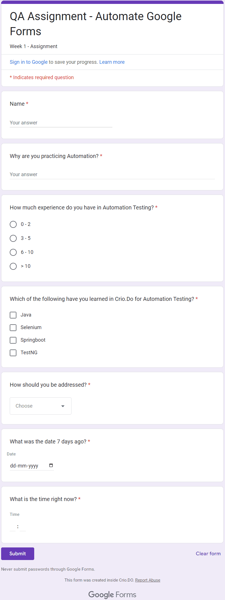
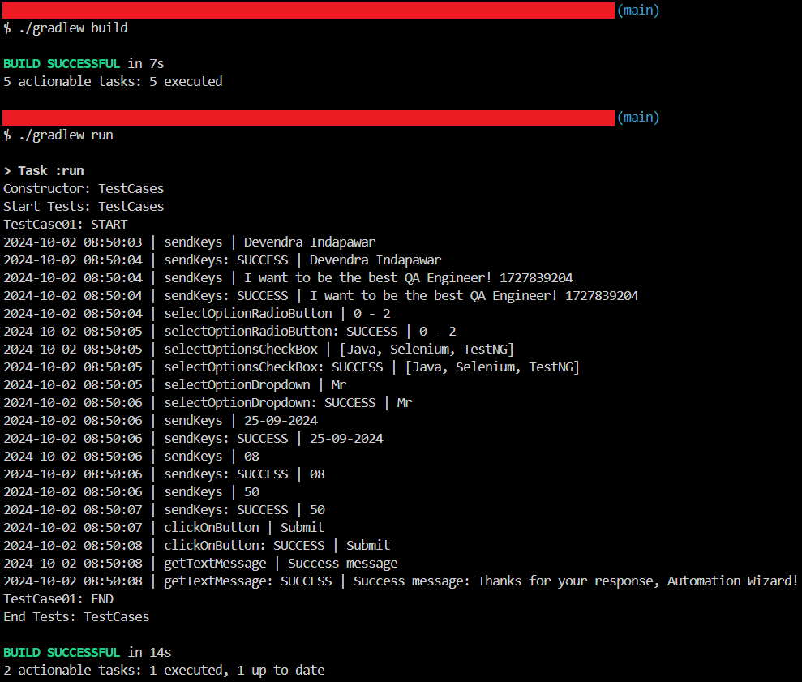

# Google Form Automation

`Selenium` `Xpath` `TestNG`

---

This project involves automating a google form, end-to-end, with a variety of different inputs such as checkboxes, dropdowns, radio-buttons and more.

---

# Overview
This project involves automating a google form, end-to-end, with a variety of different inputs such as checkboxes, dropdowns, radio-buttons and more.

# Automating Google Calculator
## Scope of work
* Automated the following Flow:
     * Navigate to [google form](https://docs.google.com/forms/d/e/1FAIpQLSep9LTMntH5YqIXa5nkiPKSs283kdwitBBhXWyZdAS-e4CxBQ/viewform) link.
     * Fill in your name in the first text box.
     * Write down 'I want to be the best QA Engineer! <epochTime>'.
     * Enter your Automation Testing experience in the next radio button.
     * Select Java, Selenium and TestNG from the next check-box.
     * Provide how you would like to be addressed in the next dropdown.
     * Provided the current date minus 7 days in the next date field.
     * Provide the current time (Keeping in mind AM/PM) in the next field.
     * Change the URL of the tab (amazon.in) and you will find the pop up. Clicked on cancel.
     * Submit the form and Print the same message on the console upon successful completion.

## Skills used
`Selenium` `Xpath` `TestNG`

---

# Screenshots

